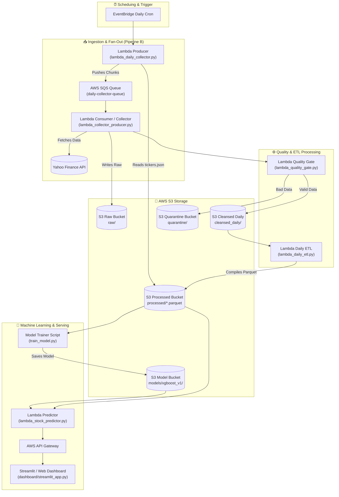

# 📈 NASDAQ Stock Price Prediction & AWS Serverless ETL Pipeline

> **Hệ thống Serverless Big Data Pipeline (ETL) & Machine Learning (XGBoost) dự đoán xu hướng giá cổ phiếu sàn NASDAQ trên nền tảng AWS Lambda, S3, SQS & Streamlit Dashboard.**

---

## 📄 Mục Lục

- [📌 Tổng Quan Dự Án](#-tổng-quan-dự-án)
- [🎯 Mục Tiêu Dự Án](#-mục-tiêu-dự-án)
- [🏗️ Kiến Trúc Hệ Thống](#️-kiến-trúc-hệ-thống)
- [📂 Cấu Trúc Thư Mục](#-cấu-trúc-thư-mục)
- [🛠️ Yêu Cầu & Tiền Chuẩn Bị](#️-yêu-cầu--tiền-chuẩn-bị)
- [🚀 Hướng Dẫn Chạy Local](#-hướng-dẫn-chạy-local)
- [☁️ Hướng Dẫn Deploy Lên AWS](#️-hướng-dẫn-deploy-lên-aws)
- [📊 Mô Hình Machine Learning & Feature Engineering](#-mô-hình-machine-learning--feature-engineering)
- [🛡️ Quản Lý Chất Lượng Dữ Liệu (Data Quality Gate)](#️-quản-lý-chất-lượng-dữ-liệu-data-quality-gate)
- [🤝 Đóng Góp & Giấy Phép](#-đóng-góp--giấy-phép)

---

## 📌 Tổng Quan Dự Án

Dự án **AWS ETL Lambda Stock Price Predict Classification** xây dựng một hệ thống tự động xử lý dữ liệu lớn (Big Data Pipeline) trên hệ thống điện toán đám mây (AWS Cloud Service). Hệ thống có khả năng:

1. **Tự động thu thập dữ liệu giao dịch cổ phiếu từ sàn NASDAQ** (1962 – Hiện tại) tự động hàng ngày thông qua Yahoo Finance API (`yfinance`).
2. **Kiểm duyệt & Làm sạch dữ liệu (Data Quality Gate & Quarantine):** Tự động phát hiện lỗi schema, thiếu dữ liệu, hoặc giá trị bất thường và cách ly dữ liệu hỏng.
3. **Biến đổi & Trích xuất đặc trưng (Feature Engineering với Polars):** Tính toán 16 chỉ báo kỹ thuật chuyên sâu (SMA, EMA, RSI, MACD, Bollinger Bands, Volatility, Lags) ở định dạng **Apache Parquet**.
4. **Huấn luyện Mô hình Machine Learning (XGBoost Classifier):** Phân loại và dự đoán hướng di chuyển giá ngày tiếp theo (`1` = Tăng, `0` = Giảm).
5. **Truy vấn API & Giao diện Dashboard (React/Vite):** Hiển thị tổng quan thị trường, bảng xếp hạng cổ phiếu khuyên mua, biểu đồ kỹ thuật và kết quả phân tích chất lượng dữ liệu.

---

## 🎯 Mục Tiêu Dự Án

- **Tự động hóa hoàn toàn (Fully Automated Pipeline):** Không cần sự can thiệp thủ công từ khi thu thập dữ liệu thô, biến đổi, dự đoán cho đến cập nhật giao diện.
- **Kiến trúc Serverless Mở rộng (Fan-Out Pattern):** Sử dụng **AWS Lambda** kết hợp **SQS Queue** giúp xử lý song song hàng ngàn mã cổ phiếu NASDAQ nhanh chóng, tối ưu chi phí.
- **Tối ưu hiệu năng lưu trữ & tính toán:** Sử dụng định dạng **Parquet** nén cao kết hợp thư viện **Polars** (nhanh hơn Pandas 10-50x).
- **Đảm bảo tính tin cậy dữ liệu:** Xây dựng cơ chế **Quality Gate & Quarantine Bucket** đảm bảo mô hình ML chỉ được huấn luyện trên dữ liệu chuẩn.

---

## 🏗️ Kiến Trúc Hệ Thống



### Các luồng xử lý chính:
- **Pipeline A (Backfill):** Thu thập dữ liệu lịch sử từ 1962 đến nay và lưu vào S3 dưới dạng Parquet chia theo năm (`processed/YYYY.parquet`).
- **Pipeline B (Daily Increment):** Thu thập dữ liệu cuối ngày -> SQS Fan-out -> Quality Gate -> Ghi đệm `cleansed_daily/` -> Tổng hợp vào `processed/`.
- **Pipeline C (Prediction & Serving):** AWS Lambda nạp mô hình XGBoost từ S3 để phục vụ dự đoán Real-time qua REST API / Dashboard.

---

## 📂 Cấu Trúc Thư Mục

```text
AWS_ETL_Lambda_Stock_Price_Predict_Classification/
├── 📁 src/                             # Mã nguồn chính của các Lambda Function & Modules
│   ├── config.py                       # Cấu hình biến môi trường, S3 bucket names & prefixes
│   ├── lambda_daily_collector.py       # Producer Lambda: Đọc tickers.json & gửi message vào SQS
│   ├── lambda_collector_producer.py    # Consumer Lambda: Nhận SQS message, tải data từ Yahoo Finance
│   ├── lambda_quality_gate.py          # Quality Gate: Kiểm tra tính hợp lệ & lọc dữ liệu lỗi
│   ├── lambda_daily_etl.py             # Daily ETL: Tổng hợp cleansed_daily thành file Parquet chính
│   ├── lambda_stock_predictor.py       # Predictor Lambda: Load XGBoost model & đưa ra dự đoán
│   ├── lambda_replay_producer.py       # Replay Producer: Phát lại dữ liệu lịch sử cho mô phỏng
│   ├── lambda_replay_consumer.py       # Replay Consumer: Xử lý từng nấc thời gian của Replay
│   ├── transform.py                    # Trích xuất 16 đặc trưng kỹ thuật bằng Polars
│   ├── validator.py                    # Schema validation & quy tắc kiểm tra chất lượng
│   ├── quarantine.py                   # Quản lý cách ly dữ liệu hỏng
│   ├── s3_service.py                   # Utilities làm việc với Amazon S3
│   ├── replay_state.py                 # Lưu trạng thái tiến trình Replay
│   ├── report.py                       # Tổng hợp & báo cáo chất lượng dữ liệu
│   └── logger.py                       # Custom logger hệ thống
├── 📁 dashboard/                       # Giao diện giám sát & dự đoán
│   ├── streamlit_app.py                # Dashboard tương tác Streamlit (Trang 1: Top Buy, Trang 2: Chi tiết mã)
│   ├── app.js / index.html             # Web UI Dashboard (React / Vite frontend)
│   └── package.json                    # Cấu hình Node.js dependencies cho Vite frontend
├── 📁 collect_data_script/             # Notebook thu thập dữ liệu lịch sử (Jupyter Notebook)
├── 📁 tests/                           # Các event mẫu để test Lambda local
├── train_model.py                      # Script huấn luyện mô hình XGBoost & xuất báo cáo
├── upload_tickers_config.py            # Upload danh sách tickers.json lên S3
├── refresh_tickers_from_nasdaq.py      # Tự động cập nhật danh sách mã cổ phiếu mới nhất từ NASDAQ
├── local_backfill.py                   # Script chạy backfill dữ liệu lịch sử tại máy local
├── run_local_test.py                   # Script chạy kiểm thử toàn bộ pipeline tại local
├── run_replay_local.py                 # Script chạy giả lập Replay simulator tại local
├── monitor_replay.py                   # Script theo dõi trạng thái Replay
├── debug_daily_pipeline.py             # Script debug luồng Daily Pipeline
├── tickers.json                        # Danh sách hơn 3,000+ mã cổ phiếu NASDAQ
├── training_report.md                  # Báo cáo đánh giá chất lượng mô hình ML tự động
├── Dockerfile                          # Docker Container định dạng AWS Lambda Python 3.12
├── requirements.txt                    # Thư viện Python phụ thuộc
└── README.md                           # Tài liệu hướng dẫn dự án
```

---

## 🛠️ Yêu Cầu & Tiền Chuẩn Bị

### 1. Phần mềm bắt buộc
- **Python:** `3.12` trở lên.
- **Docker Desktop:** Cần thiết nếu build image deploy lên AWS ECR / Lambda Container.
- **Node.js & npm:** (Tùy chọn) Để chạy giao diện Vite Dashboard trong thư mục `dashboard/`.
- **AWS CLI:** Đã cài đặt và cấu hình (`aws configure`).

### 2. Cấu hình Tài khoản AWS
Tài khoản AWS cần các quyền dịch vụ sau:
- **Amazon S3:** Read/Write trên các bucket.
- **AWS Lambda:** Tạo và thực thi container functions.
- **Amazon SQS:** SendMessage / ReceiveMessage.
- **Amazon ECR:** Login, Push/Pull Docker Images.
- **Amazon EventBridge:** Set up Cron Schedule.
- **Amazon API Gateway:** Tạo REST API endpoint.

---

## 🚀 Hướng Dẫn Chạy Local

### Bước 1: Clone Repository & Tạo Môi trường ảo

```bash
git clone https://github.com/MinhVuongNhat/AWS_ETL_Lambda_Stock_Price_Predict_Classification.git
cd AWS_ETL_Lambda_Stock_Price_Predict_Classification

# Tạo venv
python -m venv .venv

# Kích hoạt venv (Windows)
.venv\Scripts\activate

# Kích hoạt venv (Linux/macOS)
# source .venv/bin/activate
```

### Bước 2: Cài đặt Thư viện Phụ thuộc

```bash
pip install --upgrade pip
pip install -r requirements.txt
```

### Bước 3: Thiết lập File Cấu hình Môi trường `.env`

Tạo file `.env` tại thư mục gốc của dự án với các thông số AWS của bạn:

```ini
AWS_REGION=ap-southeast-1
AWS_ACCESS_KEY_ID=YOUR_AWS_ACCESS_KEY
AWS_SECRET_ACCESS_KEY=YOUR_AWS_SECRET_KEY

# S3 Buckets
RAW_BUCKET=my-nasdaq-stock-market-raw-2026-ap-southeast-1
PROCESSED_BUCKET=my-nasdaq-stock-processed-2026-ap-southeast-1
MODEL_BUCKET=my-nasdaq-stock-models-2026-ap-southeast-1
SIM_BUCKET=my-nasdaq-stock-simulation-2026-ap-southeast-1

# SQS Queue URL
SQS_QUEUE_URL=https://sqs.ap-southeast-1.amazonaws.com/123456789012/daily-collector-queue
```

### Bước 4: Upload Danh sách Mã Tickers lên S3

```bash
python upload_tickers_config.py --file tickers.json
```

### Bước 5: Chạy Kiểm Thử Pipeline Tại Local

```bash
# Debug luồng ETL hàng ngày
python debug_daily_pipeline.py

# Hoặc chạy kiểm thử toàn diện
python run_local_test.py
```

### Bước 6: Huấn Luyện Mô Hình XGBoost Local

```bash
python train_model.py
```
*Script sẽ tải dữ liệu từ S3 Processed bucket, trích xuất đặc trưng, huấn luyện mô hình XGBoost, lưu kết quả mô hình `xgboost_model.json` lên S3 và tạo báo cáo `training_report.md` cùng các biểu đồ đánh giá.*

### Bước 7: Khởi Chạy Streamlit Dashboard

```bash
streamlit run dashboard/streamlit_app.py
```
Mở trình duyệt tại `http://localhost:8501` để xem giao diện Dashboard.

---

## ☁️ Hướng Dẫn Deploy Lên AWS

### 1. Tạo các S3 Buckets & SQS Queue

Sử dụng AWS CLI hoặc Console để tạo:
```bash
aws s3 mb s3://my-nasdaq-stock-market-raw-2026-ap-southeast-1 --region ap-southeast-1
aws s3 mb s3://my-nasdaq-stock-processed-2026-ap-southeast-1 --region ap-southeast-1
aws s3 mb s3://my-nasdaq-stock-models-2026-ap-southeast-1 --region ap-southeast-1
aws s3 mb s3://my-nasdaq-stock-simulation-2026-ap-southeast-1 --region ap-southeast-1

# Tạo SQS Queue
aws sqs create-queue --queue-name daily-collector-queue --region ap-southeast-1
```

### 2. Build & Push Docker Image lên AWS ECR

```bash
# 1. Đăng nhập ECR
aws ecr get-login-password --region ap-southeast-1 | docker login --username AWS --password-stdin <YOUR_ACCOUNT_ID>.dkr.ecr.ap-southeast-1.amazonaws.com

# 2. Tạo ECR Repository (nếu chưa có)
aws ecr create-repository --repository-name nasdaq-etl-lambda --region ap-southeast-1

# 3. Build Docker Image
docker build -t nasdaq-etl-lambda:latest .

# 4. Tag Image
docker tag nasdaq-etl-lambda:latest <YOUR_ACCOUNT_ID>.dkr.ecr.ap-southeast-1.amazonaws.com/nasdaq-etl-lambda:latest

# 5. Push Image lên ECR
docker push <YOUR_ACCOUNT_ID>.dkr.ecr.ap-southeast-1.amazonaws.com/nasdaq-etl-lambda:latest
```

### 3. Cấu hình các AWS Lambda Functions

Tạo các Lambda functions từ ECR Image đã push:

| Lambda Function Name | Image CMD Override | Mô tả |
| :--- | :--- | :--- |
| `nasdaq-daily-collector` | `src.lambda_daily_collector.lambda_handler` | Đọc `tickers.json` và phân đoạn gửi vào SQS Queue. |
| `nasdaq-collector-producer` | `src.lambda_collector_producer.lambda_handler` | Lắng nghe SQS, cào dữ liệu từ YFinance và ghi vào S3 Raw. |
| `nasdaq-quality-gate` | `src.lambda_quality_gate.lambda_handler` | Kiểm duyệt chất lượng dữ liệu và chia đường Cleansed / Quarantine. |
| `nasdaq-daily-etl` | `src.lambda_daily_etl.lambda_handler` | Tổng hợp dữ liệu hàng ngày vào kho dữ liệu chính Parquet. |
| `nasdaq-stock-predictor` | `src.lambda_stock_predictor.lambda_handler` | Phục vụ dự đoán xu hướng giá qua mô hình ML. |

### 4. Thiết lập EventBridge Cron Triggers

Cấu hình lịch chạy tự động hàng ngày (Ví dụ: 0:00 UTC từ Thứ Hai đến Thứ Sáu):
- **Rule Name:** `nasdaq-daily-pipeline-trigger`
- **Schedule:** `cron(0 0 ? * MON-FRI *)`
- **Target:** AWS Lambda `nasdaq-daily-collector`

---

## 📊 Mô Hình Machine Learning & Feature Engineering

### 1. Danh sách 16 Đặc Trưng Kỹ Thuật (Feature Engineering)

Mô hình sử dụng thư viện **Polars** tính toán song song các chỉ số kỹ thuật từ giá lịch sử (`Open`, `High`, `Low`, `Close`, `Volume`):

- **Xu hướng & Trung bình động:** `SMA_5`, `SMA_20`, `EMA_12`, `EMA_26`
- **Giá trễ (Lagged Features):** `Lag_Close_1`, `Lag_Close_2`, `Lag_Close_3`
- **Biến động & Tỷ suất sinh lời:** `Daily_Return`, `Intraday_Volatility`
- **Chỉ báo Động lượng (MACD):** `MACD`, `MACD_Signal`, `MACD_Hist`
- **Chỉ báo Quá mua/Quá bán:** `RSI_14`
- **Dải Bollinger Bands:** `BB_Upper`, `BB_Lower`, `BB_Width`

### 2. Thuật toán & Mục tiêu Phân loại
- **Thuật toán:** `XGBoostClassifier` (Binary Logistic)
- **Mục tiêu (Label):**
  - `1` (Tăng): Giá đóng cửa ngày tiếp theo $> $ Giá đóng cửa hôm nay.
  - `0` (Giảm): Giá đóng cửa ngày tiếp theo $\le$ Giá đóng cửa hôm nay.

### 3. Kết quả Huấn luyện (Trích từ `training_report.md`)

| Chỉ số (Metric) | Giá trị |
| :--- | :--- |
| **Accuracy** | `53.12%` |
| **Precision** | `0.5311` |
| **Recall** | `0.4828` |
| **F1 Score** | `0.5058` |
| **AUC-ROC** | `0.5487` |

---

## 🛡️ Quản Lý Chất Lượng Dữ Liệu (Data Quality Gate)

Hệ thống tích hợp module kiểm tra chất lượng dữ liệu nghiêm ngặt (`src/validator.py` & `src/lambda_quality_gate.py`):

- **Kiểm tra Schema:** Đảm bảo đủ các cột bắt buộc (`Date`, `Ticker`, `Open`, `High`, `Low`, `Close`, `Volume`).
- **Kiểm tra Miền giá trị:** Loại bỏ các giá trị âm (`Close < 0`, `Volume < 0`), kiểm tra tính hợp lệ `High >= Low`, `High >= Open/Close`.
- **Phát hiện Dữ liệu Thiếu (Null/NaN Check):** Lọc các mã thiếu dữ liệu quá ngưỡng cho phép.
- **Cơ chế Quarantine:** Các bản ghi không đạt kiểm duyệt sẽ tự động đẩy sang đường dẫn `quarantine/yyyy-mm-dd/` trên S3 để phục vụ việc soi lỗi và debug mà không làm gián đoạn luồng ETL chính.

---

## 🤝 Đóng Góp & Giấy Phép

Dự án được phát triển phục vụ mục đích nghiên cứu, học thuật và xây dựng hệ thống xử lý dữ liệu lớn trên đám mây AWS.

Mọi đóng góp, báo lỗi (Issue) hoặc đề xuất tính năng (Pull Request) đều được hoan nghênh!

---
